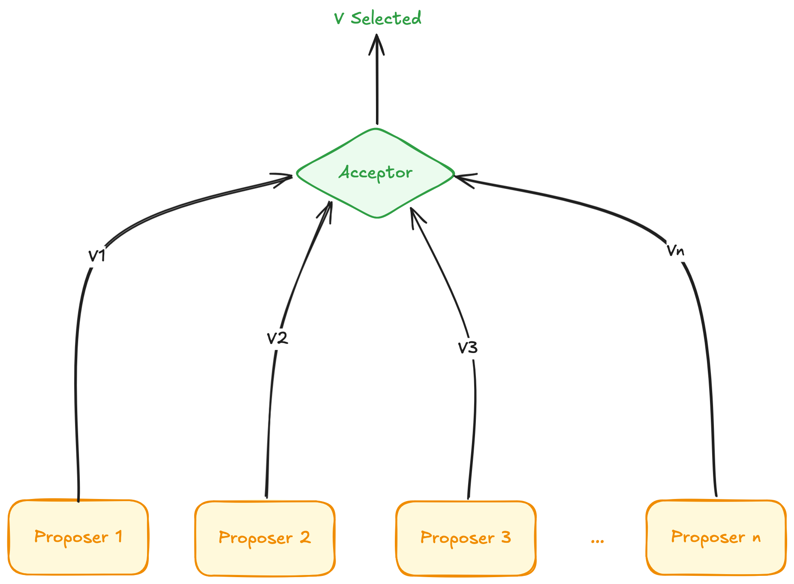
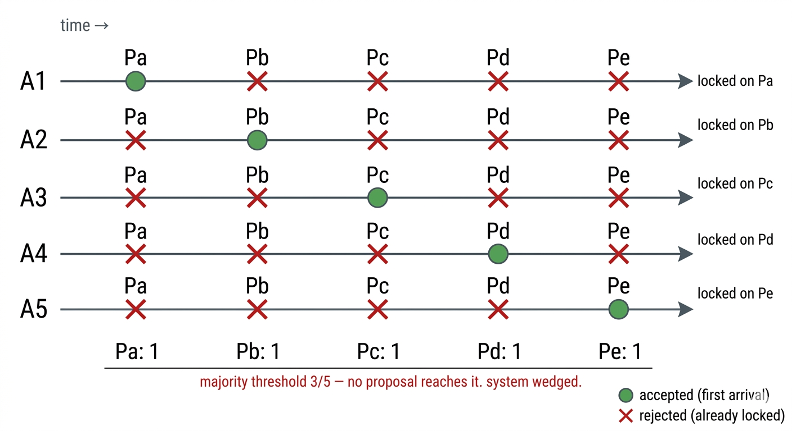
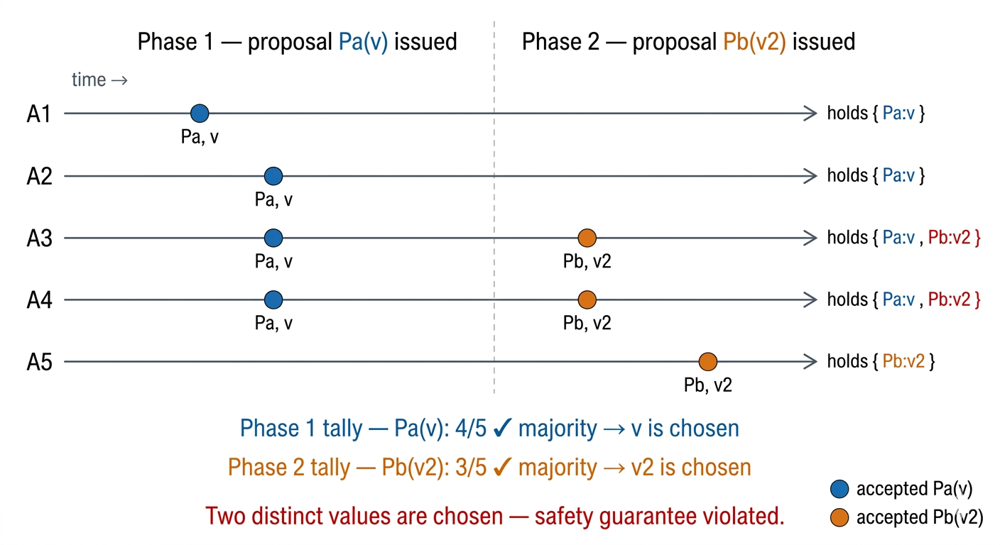
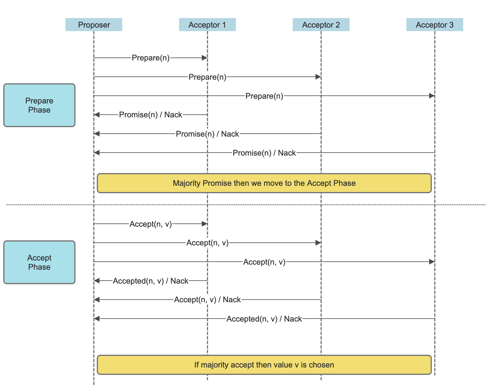

# Paxos Made Simple
Paxos is a consensus algorithm, as you'd already have known. Simply put, given a set of processes giving generating some values, the system will choose *only one* value and will remember that chosen value.

## Terminology
Before you go forward with this article we'll explain some of the terms used throughout in the most basic of forms (I'll try at least).
- **Proposers:** Proposers are entities that propose a value that is to be considered for the consensus. They propose some value to the acceptors, and depending on their answer the consensus is reached.
- **Acceptors:** An acceptor takes in the proposals from the *proposer* and either rejects it or accepts it. Depending on how many of the acceptors have accepted a particular proposal, consensus may or may not be reached for that particular proposal.
- **Learners:**
- **Chosen Value**: The value that we've reached consensus for. The algorithm has concluded that value v is the chosen value.

## What are the Guarantees that Paxos Gives?
Before we move on to the guarantees, let's sort out the assumptions it makes:
- We're following a *non asynchronous, non-Byzantine* model. Heavy emphasis on non-Byzantine.
- An agent can operate at arbitrary speed, can fail/stop and restart.
- Packets/Messages over the networks may be lost, duplicated, or delayed, but they're never corrupted.

With these assumptions in mind, Paxos aims to give the following guarantees about the chosen value:
- It will be a value that has been proposed, i.e. if a value was not proposed by any of the proposers it can never be chosen.
- Only a ***single*** value is chosen
- A process never learns that a value is chosen unless the value has actually been chosen.

## How does Paxos actually work?
With the pre-requisites out of the way we can now jump into how the algorithm actually works.

I'll say this upfront so it's not conflated down the line - The goal of Paxos is to be a ***write-once*** register, a single iteration of Paxos aims to achieve consensus for one thing, and one thing only. Once a value is chosen the value never changes. We often think of the goal as a state machine replication (I was guilty of that as well) where multiple states are considered and the system is to reach consensus for each one of them. So if you're thinking of that model it's the wrong assumption, **PAXOS doesn't do that, at least not the vanilla version.**

Simply put:
- Proposer sends a proposal to the acceptors
- If a majority of the acceptors accept the proposal then consensus is reached.

### Single Acceptor
For single acceptor systems the outcome is pretty simple, whichever proposal the acceptor accepts first is the chosen value we're now done.

But with a single acceptor we have a glaring problem, if that single acceptor goes down our system comes to a screeching halt. All of our proposers end up wistfully waiting for it to come back online.

### Multiple Acceptors
We naturally now want to try multiple acceptors, and now we must wait until a certain number of acceptors have accepted our value before calling it chosen.

If we have an even number of acceptors then there can be concrete majority meaning two disjoint set of n acceptors could have chosen two different values, so the number of acceptors must be odd, and the majority must be **n + 1** given **2n + 1** acceptors.  This also means that we can tolerate upto **n** failures, since as long as **n + 1** servers are online mathematically at lest one of the **n + 1** servers is guaranteed to have been a part of the prior majority.

Now we've got a guideline: **If a proposal is accepted by n + 1 acceptors, given 2n + 1 total acceptors, that proposal is chosen and we've reached consensus.**

We'll now go through a couple of scenarios to see how the proposals can flow and what happens to our system given this single guideline, and that the acceptors accepts only the first proposal that reaches them.
#### Scenario 1: Accept Only the First Value
Consider a system with 5 acceptors. The system starts and none of the acceptors have yet to accept any proposals. Now 5 distinct proposals are issued. Remember that they can be delayed or lost, meaning we can end up in a situation where each of the acceptors has accepted one of the 5 proposals. In which case all acceptors have accepted a value but no majority is reached, and the system can make no further progress with the current constraints.

We'll loosen the constraint to: `An acceptor can accept multiple proposals`.

#### Scenario 2: Accept Multiple Proposal
With the new constraint that an acceptor may accept multiple proposals let's consider the following:

We've got 5 acceptors once again, at the start they're idle and then a proposal Pa with some value v is issued, and 4 of the 5 acceptors have accepted that proposal. According to our guideline we've reached consensus.

Now one more proposal Pb with value v2 is issue. According to our updated constraints the acceptors can accept this proposal, and say 3 of the acceptors accept this new proposal now the chosen value is v2. This violates one of our guarantees that once a value is chosen it won't be changed.

To mitigate this we need some mechanism that would let the system remember that a value has indeed been chosen. The most common choice that comes to mind is that after a consensus is reached the acceptors should no longer accept any values. Paxos doesn't go this route, it mandates that `once a value is chosen, all further proposals must be made with the chosen value`, and that's where the non-Byzantine comes into play. Now the proposer carries the weight of correctness, if consensus is reached it's the proposers responsibility to propose with the chosen value only. If a malicious proposer comes into play the algorithm will fail.

To achieve this Paxos numbers each proposal. The proposal numbers are monotonically increasing drive the core of the algorithm.

### The Actual Algorithm
The algorithm is split into two phases:
1. Prepare Phase
2. Accept Phase

#### Prepare Phase
During this phase 
- The proposer will send a prepare request to all the acceptors and try to extract a promise from the acceptors stating that the acceptor will no longer *accept proposals numbered less that the proposed proposal*. 
- The acceptor will respond positively to the prepare request only if it hasn't responded to a prior prepare request with higher number. 
	- If the proposal is rejected then the acceptor either ignores the request or rejects it and provides the proposal number it has already promised. 
		- Ignoring is fine but practically you'd want to send back the highest promised number so the proposer doesn't have to blindly try incrementing until it reaches the required proposal number.
	- If he acceptor accepts the prepare request it responds with two things:
		1. A promise to not accept proposals numbered less than the currently held proposal.
		2. The highest proposal that the acceptor had accepted prior to this and it's value, if it had accepted one already. Returns nothing otherwise.

If a majority of the acceptors accept the prepare request then the proposer can proceed to the **Accept phase**.

#### Accept Phase
- The proposer will keep the proposal number, and choose the value corresponding to the highest proposal number returned to it by the acceptors during the prepare phase. If no acceptors returned one, the proposer is free to choose any value.
- The proposer now sends an accept request carrying the proposal_number, and value to all of the acceptors. (Since it passed the prepare phase the majority has agreed and we're not constrained to sending to only the acceptors that accepted the prepare request)
	- If a majority of the acceptors accept this request consensus is reached. This holds true even if we get some rejections.

The final form of the algorithm looks as below:

